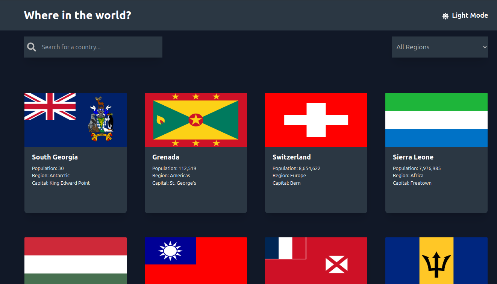

# Country Details React App

## [Visit the project](https://react-rest-countries-project.vercel.app/)

This is a React app that provides detailed information about countries. You can search and filter countries by region, and click on a country to view more detailed information on a separate page. The data is fetched from the [Country Data API](https://restcountries.com/v3.1/all).

## Features

- **Search**: You can search countries by their name.
- **Filter by Region**: Filter countries based on their geographical region (e.g., Africa, Americas, Asia, etc.).
- **Country Details Page**: Click on any country to navigate to a detailed page containing more information, such as population, area, languages, and flags.
  
## Technologies Used

- **React**: JavaScript library for building user interfaces.
- **React Router**: For handling navigation between pages.
- **Tailwind CSS**: For styling the app.
